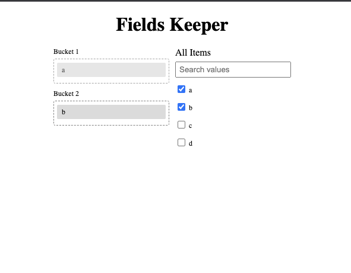

# React Fields Keeper

Flexible bucket based data assignment tool for react

[](https://badge.fury.io/js/react-fields-keeper)


### Gettings Started
1. Installation
   
    `yarn add react-fields-keeper`

    or

    `npm install react-fields-keeper`
2. Usage
   ```tsx
   import {
        FieldsKeeperProvider, 
        FieldsKeeperBucket, 
        FieldsKeeperRootBucket
    } from 'react-fields-keeper';

    export default function Component() {
        return <>
            ...
            <FieldsKeeperProvider allItems={[]} buckets={[]}>
                ...
                <FieldsKeeperBucket id="1" />
                ...
                <FieldsKeeperBucket id="2" />
                ...

                ...
                <FieldsKeeperRootBucket />
                ...
            <FieldsKeeperProvider/>
            ...
        </>
    }
   
   ```

3. Sample Output
   


### Getting Hands On

* [Demo (vercel) ](https://react-fields-keeper.vercel.app/)

* [Codesandbox to live tweak the library](https://codesandbox.io/p/github/ThayalanGR/react-fields-keeper/main?layout=%257B%2522sidebarPanel%2522%253A%2522EXPLORER%2522%252C%2522gitSidebarPanel%2522%253A%2522COMMIT%2522%252C%2522rootPanelGroup%2522%253A%257B%2522direction%2522%253A%2522horizontal%2522%252C%2522type%2522%253A%2522PANEL_GROUP%2522%252C%2522id%2522%253A%2522ROOT_LAYOUT%2522%252C%2522panels%2522%253A%255B%257B%2522type%2522%253A%2522PANEL_GROUP%2522%252C%2522direction%2522%253A%2522vertical%2522%252C%2522id%2522%253A%2522EDITOR%2522%252C%2522panels%2522%253A%255B%257B%2522type%2522%253A%2522PANEL%2522%252C%2522panelType%2522%253A%2522TABS%2522%252C%2522id%2522%253A%2522clhklnwgm000a3b6trco9zhsk%2522%257D%255D%252C%2522sizes%2522%253A%255B100%255D%257D%252C%257B%2522type%2522%253A%2522PANEL_GROUP%2522%252C%2522direction%2522%253A%2522vertical%2522%252C%2522id%2522%253A%2522DEVTOOLS%2522%252C%2522panels%2522%253A%255B%257B%2522type%2522%253A%2522PANEL%2522%252C%2522panelType%2522%253A%2522TABS%2522%252C%2522id%2522%253A%2522clhklnwgm000c3b6t7ufed2l2%2522%257D%255D%252C%2522sizes%2522%253A%255B100%255D%257D%255D%252C%2522sizes%2522%253A%255B50%252C50%255D%257D%252C%2522tabbedPanels%2522%253A%257B%2522clhklnwgm000a3b6trco9zhsk%2522%253A%257B%2522tabs%2522%253A%255B%257B%2522id%2522%253A%2522clhklnwgm00093b6t5eqa1kej%2522%252C%2522mode%2522%253A%2522permanent%2522%252C%2522type%2522%253A%2522FILE%2522%252C%2522filepath%2522%253A%2522%252FREADME.md%2522%252C%2522state%2522%253A%2522IDLE%2522%257D%255D%252C%2522id%2522%253A%2522clhklnwgm000a3b6trco9zhsk%2522%252C%2522activeTabId%2522%253A%2522clhklnwgm00093b6t5eqa1kej%2522%257D%252C%2522clhklnwgm000c3b6t7ufed2l2%2522%253A%257B%2522id%2522%253A%2522clhklnwgm000c3b6t7ufed2l2%2522%252C%2522activeTabId%2522%253A%2522clhkmmjhn00fj3b6ndk1cnjc0%2522%252C%2522tabs%2522%253A%255B%257B%2522id%2522%253A%2522clhklnwgm000b3b6t1ll07y8a%2522%252C%2522mode%2522%253A%2522permanent%2522%252C%2522type%2522%253A%2522TERMINAL%2522%252C%2522shellId%2522%253A%2522clhkloshj0003fyhpb1ww7nub%2522%257D%252C%257B%2522type%2522%253A%2522TASK_LOG%2522%252C%2522taskId%2522%253A%2522start%2522%252C%2522id%2522%253A%2522clhkmmhbb00a63b6n691zlvfx%2522%252C%2522mode%2522%253A%2522permanent%2522%257D%252C%257B%2522type%2522%253A%2522TASK_PORT%2522%252C%2522taskId%2522%253A%2522start%2522%252C%2522port%2522%253A3000%252C%2522id%2522%253A%2522clhkmmjhn00fj3b6ndk1cnjc0%2522%252C%2522mode%2522%253A%2522permanent%2522%252C%2522path%2522%253A%2522%252F%2522%257D%255D%257D%257D%252C%2522showDevtools%2522%253Atrue%252C%2522showSidebar%2522%253Atrue%252C%2522sidebarPanelSize%2522%253A15%257D)

### Change logs
- publish badges setup and readme updates
- Stability patch update for v0.4.1
- Stability fixes for v0.4.0
- Migrated to Vite with react + swc for preview

### Usage Code Snippet

https://github.com/ThayalanGR/react-fields-keeper/blob/3b6dbadd79c3890314952de7f08ba6285c95f2c0/src/App.tsx#LL1C1-L41C2  